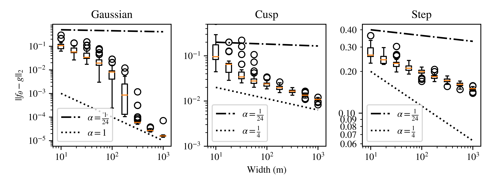
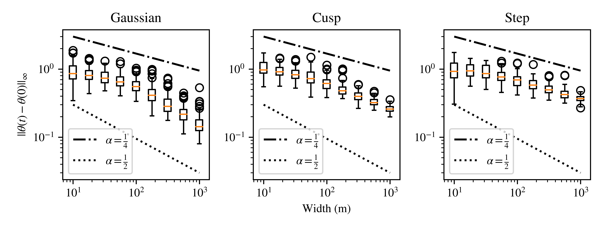
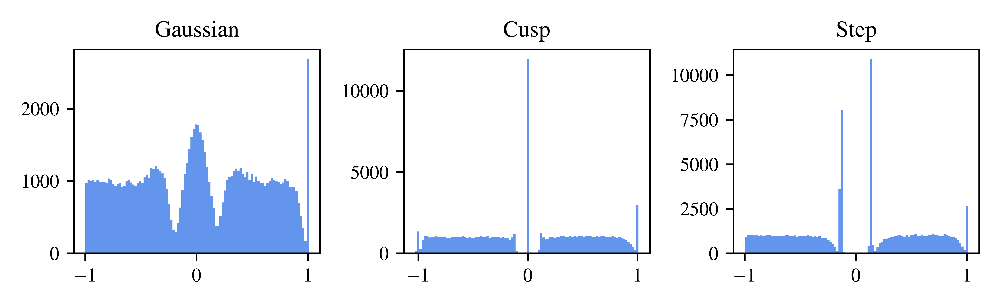

# Approximation Rates of a Trained Neural Network

Given a neural network $f_\theta$ and target function $g$, a typical approximation theory result is of the form:

$$\begin{align*}
\inf_{\theta}||f_\theta - g|| \lesssim n(\theta)^{-\alpha}, & \quad g \in K
\end{align*}$$

bounding the error as a function of the number of trainable parameters, $\theta$, at a rate $\alpha$ for some class of functions, $K$. Larger models, being more expressive, can generally achieve smaller approximation error. In most such papers, the proofs rely on hand-crafted networks, where the weights and biases are carefully selected. The goal of this project is to find the approximation rate, $\alpha$, for a practical neural network that can be realized via training. Thus far, we've only considered one-dimensional shallow models:

$$f_\theta(x) := \frac{1}{\sqrt{m}} \sum_{r=1}^m a_r \sigma(x - \theta_r)$$

For my master's thesis, I [proved](https://stars.library.ucf.edu/etd2020/1203) that a rate of up to $\alpha=\frac{1}{4}$ can be achived with the assumption that the smoothness of the residual, $||f_\theta - g||_{H^1}$, is uniformly bounded. More recently, we've [shown](https://arxiv.org/abs/2209.08399) that $\alpha=\frac{1}{24}$ can be achieved with no such assumption. Our theoretical results rely on a neural tangent kernel (NTK) argument, which also seems promising for multiple dimensions and deeper networks.

## Experimental Setup
For target functions of varying smoothness we use, a Gaussian, a cusp and a step:

$$\begin{align*}
g(x) = \frac{5}{4 \sqrt{2 \pi}}e^{-\frac{25}{2}x^2} & \quad g(x) = 1 - \sqrt{|x|} & \quad g(x) = \begin{cases} 
    0 & x\leq 0 \\
    1 & x > 0 
  \end{cases}
\end{align*}$$

The neural network $f_\theta$ is trained to fit each function with varying width $m$. Since the process is non-deterministic, training each function-width pair is repeated one-hundred times, with statistics for each visualized as box plots. 

## Sample Results
### Function Approximation Rates
The main result of these experiments is summarized by the following figure. A rate $\alpha$ is given by the slope of a line drawn on a log-log scale. In all cases, the rate is greater than what our theory predicts but less than that of a free-knot or uniform linear spline. 

### Breakpoint Convergence
A crucial point in constructing our proof arguments is that as $m$ increases, the change in parameters of our network $\theta$ decreases. In this case though, the rates are much closer to $\alpha=\frac{1}{3}$, the value predicted by our theory.

Each $\theta_r$ coincides with a breakpoint location. These can also be visualized with histograms. At initialization, these would be uniform. After training though, we see a significant change, with the distributions corresponding roughly to the the absolute values of the second derivatives of the target functions.

## Installation / Usage
See: [here](./scripts/README.md)
